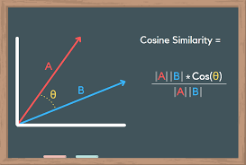

# SpotiRec
[Link to the website](https://rohithraj02-spotirec-main-7ape2z.streamlit.app/)
---
SpotiRec is a web-based Spotify recommendation system that uses a content filtering algorithm which recommends songs based on the cosine similarity metric. By calculating the cosine similarity between the user’s songs and the characteristics of other tracks, SpotiRec can recommend new and exciting musical possibilities that align with your taste. SpotiRec does not just take simple genre-based suggestions but also takes into account several other features of the songs like Acousticness, Danceability, Energy, Loudness and many more features to provide accurate recommendations. By leveraging user data and machine learning algorithms, this project offers a tailored and engaging music listening journey, that helps to users find their favorite songs and discover new musical gems along the way.

# Cosine Similarity

     

Cosine similarity is a measure of similarity between two non-zero vectors defined in an inner product space. Cosine similarity is the cosine of the angle between the vectors; that is, it is the dot product of the vectors divided by the product of their lengths. It follows that the cosine similarity does not depend on the magnitudes of the vectors, but only on their angle. 

# Working of the Project
<!--  -->

     

There are two main modules in this project. Model.py which deals with the machine learning model that generates the recommendations and Main.py which deals with rendering the user interface of the project with the help of Streamlit framework. The final project is then deployed on the streamlit cloud. 

